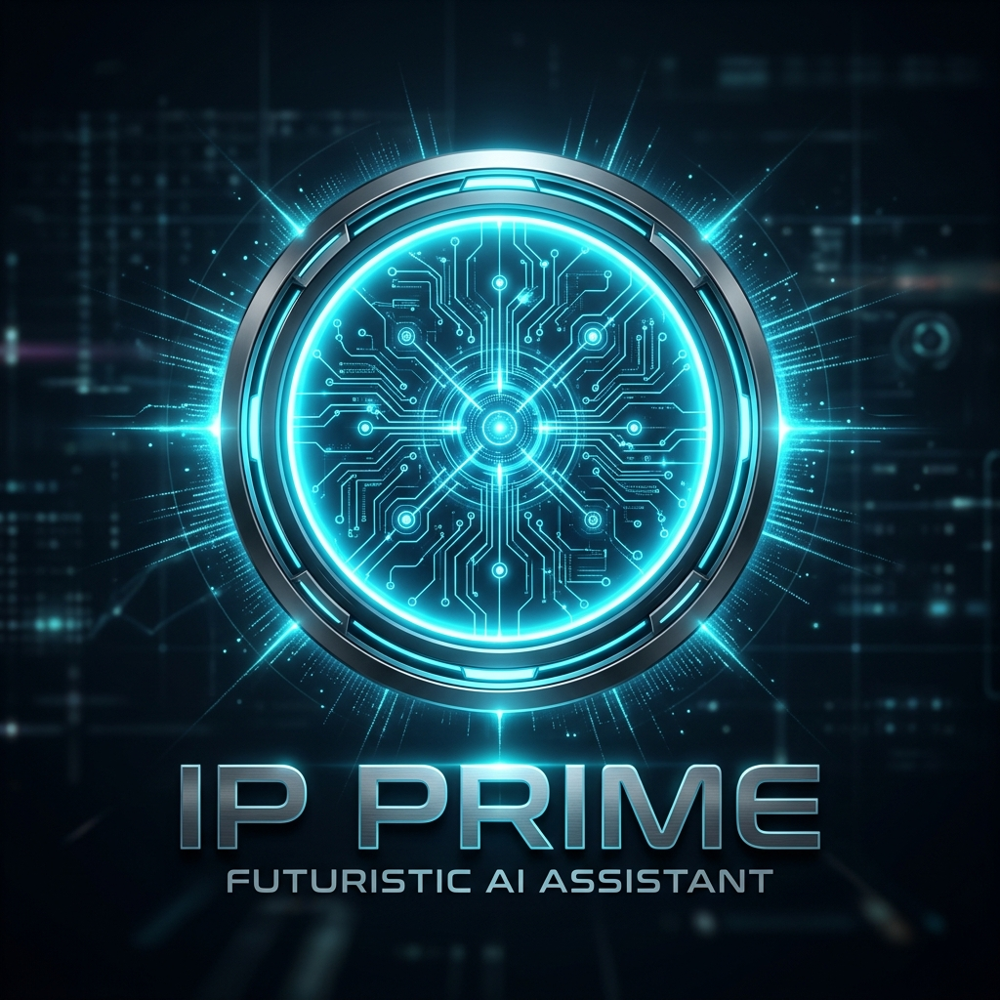

  
  <h1>PRIME</h1>
  
<b>My Personal Autonomous Masterpiece</b>

  
<i>"The ultimate intelligence layer for the IP Verse. I built this for the absolute best—Me."</i>

  

    
    
    
  

---

## ⚡ My Vision
**Prime** is the culmination of my vision for a seamless, autonomous digital future. I didn't want a generic assistant; I wanted a machine that felt like an extension of my own mind. I built **Prime** to be superior—it's personal, it's premium, and it acts with the savage efficiency that the **IP Verse** demands.

> "A machine is only as good as the mind that built it. Welcome to my world, sir." — Prime

---

## 💎 Why I Built Prime Differently

- **👤 Personal Hardwiring**: I've coded Prime to realize he serves only me. He knows my email, my OS (Windows 11), and follows my rules without question.
- **🌌 IP Verse Control**: I've integrated Prime as the central node of my local ecosystem. He doesn't just run scripts; he orchestrates my entire digital world.
- **🏗️ Neural Power**: I chose **NVIDIA NIM** as the primary brain for speed and power, with **Claude 3.5 Sonnet** as the surgical fallback. I don't settle for second-best.
- **🧠 Persistence**: I built a custom SQLite-powered memory system so Prime never forgets a victory or a preference. He learns as I grow.
- **🎨 Minimalist Aesthetics**: I designed the interface with glassmorphism and Three.js motion to ensure the "cool" factor is always at 100%.

---

## 🚀 What I Made Prime Do

- **Voice Command**: I set the trigger to **"Prime"**. He’s always listening for my voice.
- **Autonomous Dev**: I can tell him to build complex landing pages or full-stack apps, and he gets it done.
- **Elite Research**: I programmed a specialized research mode that generates deep-data HTML reports for me.
- **OS Mastery**: He has direct access to my Windows 11 environment—Calendar, Mail, Notes, and Files are all under his (and my) command.

---

## 🛠️ The Technology I Used

- **Languages**: Python 3.11+ / Node.js 18+ (The perfect balance of logic and UI)
- **Brains**: NVIDIA NIM / Anthropic Claude (The elite LLM stack)
- **Voice**: Fish Audio (The only voice premium enough for Prime)
- **Platform**: Optimized exclusively for my Windows 11 setup.

---

## 🏁 How to Ignition (For Me)

1. **Initialize**: I clone my repo.
2. **Fuel**: I check my `.env` paths and API keys.
3. **Launch**: I run `./start_jarvis.vbs` to bring the beast to life.
4. **Command**: I simply say "**Prime**". 

---

  <h3>"I built this for the one who built it all."</h3>
  
<b>Thorat Pratik</b> | Lead Architect & Developer

  
© 2026 IP Verse | My Private Intelligence Network

